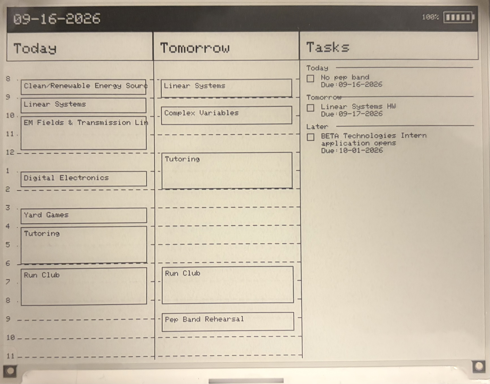

# An ESP32-powered epaper display for daily events
**Work on this project is ongoing**
This project uses and ESP32 to talk to google calendar and an Epaper display to show a concise review of upcoming events and tasks. At its core, the ESP32 communicates with a Google Scripts deployment to collect event and task data, then parses this data and prints the information to the display. The project is designed to be cheap and accessible, using few hardware parts, and capable of used by any IDE that can communicate with an ESP32. 

## To do list:
The goal of this project is for the ESP32 to:
- [x] Get events from google calendar
- [x] Get tasks from google tasks
- [x] Be battery powered
- [ ] Display these events and other pertinent information on an Epaper display
- [ ] Refresh once per day, or when user presses a reset button

Additional goals include:
- [ ] Design a custom housing for the display
- [ ] Design a custom PCB to fit in the housing better

## Current capabilities:
**9/17/2026**: The project can get and display all pertinent information to the epaper display (some GUI clean-up and bug fixes still in progress). It also displays the current date and battery percentage. Next steps: have the processor go into deep sleep between refreshes to conserve battery power, and only refresh once per day or when the user presses a refresh button.

## Hardware Requirements:
- Any ESP32 w/ Wifi capability
- Waveshare 5.83" black and white epaper display (https://www.waveshare.com/5.83inch-e-paper-hat.htm)
- 3.7V lithium-ion battery

## Setup:
*Coming soon*